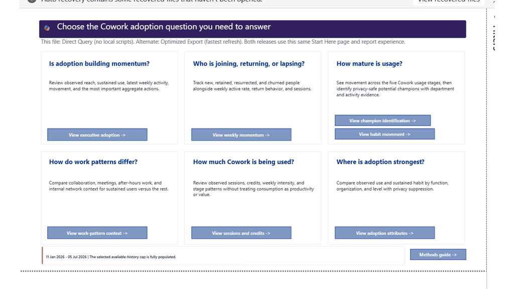
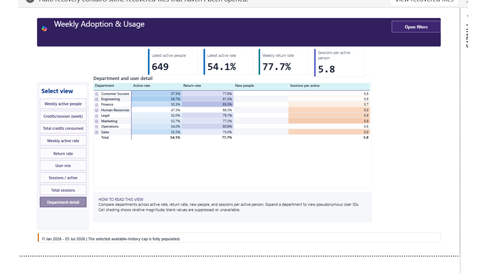

# CoworkSuperUser

> **Turn Viva Insights and Microsoft 365 Copilot Cowork consumption data into a
> clear, privacy-aware story of reach, repeat use, usage stages, potential
> champions, and work-pattern context.**

[](CHANGELOG.md)
[](src/)
[](SECURITY.md)
[](https://microsoft.github.io/Analytics-Hub/)

> [!IMPORTANT]
> **Template status: Public and in testing.** Validate source coverage, privacy
> requirements, outputs, and metric definitions before using findings for
> production decisions.

CoworkSuperUser is a data-free Power BI template for Cowork program owners,
Viva Insights analysts, adoption leads, enablement teams, and Power BI owners.
It combines:

- A Viva Insights Person Query that defines the approved person-week population
- A Microsoft 365 Copilot consumption query filtered to exactly
  `Service Name = "Cowork"`
- Available-history usage stages and movement
- Cowork sessions, credits, and consumption intensity
- Organizational adoption patterns and potential peer-enablement champions
- Descriptive collaboration, network, and beyond-hours context
- A complete glossary for all 117 semantic-model measures, including helpers

Both connection editions provide the same nine report pages, 39
bookmark-controlled states, 117 measures, visual logic, filters, privacy rules,
and interpretation guidance.

<div align="center">

</div>

The preview uses deterministic fabricated Contoso, Fabrikam, and Northwind data
for 1,200 fictional people across 26 weeks. It contains no customer findings,
identities, or benchmarks.

> **CoworkSuperUser Walkthrough:** a narrated tour of observed reach, weekly
> return, usage-stage movement, potential champions, sessions and credits,
> work-pattern context, metric interpretation, and the two setup paths.

https://github.com/user-attachments/assets/67e54184-bc7f-4e7f-a2fc-ed6d8c34545f

[Open or download the MP4](media/CoworkSuperUser-Walkthrough.mp4) ·
[Read the transcript](media/CoworkSuperUser-Walkthrough-transcript.md) ·
[Download subtitles](media/CoworkSuperUser-Walkthrough.srt)

---

## New here? Start in 3 steps

1. Ask a Viva Insights analyst to create the
   [Person and Cowork consumption queries](docs/QUERY_SETUP.md).
2. Download the
   [Direct Query template](https://github.com/microsoft/CoworkSuperUser/raw/main/CoworkSuperUser%20-%20Direct%20Query.pbit)
   or
   [Optimized Export template](https://github.com/microsoft/CoworkSuperUser/raw/main/CoworkSuperUser%20-%20Optimized%20Export.pbit).
3. Enter the requested identifiers or export folder, select **Load**, and
   complete the [post-load checks](SETUP.md).

The Direct Query edition is the simplest customer experience: enter the
Partition, Person Query, and Consumption Query identifiers. The Viva Insights
connector retrieves saved-query results and Power BI imports them during
refresh; this is not Tabular DirectQuery storage mode.

> **Not ready to load production data?** Review the animation, walkthrough,
> interpretation storyboard, and fabricated page captures first. The public
> assets contain no customer data.

---

## What the report answers

| Page | Business question |
| --- | --- |
| **Start Here** | Which page and connection path should I use? |
| **Executive Adoption** | Is observed Cowork reach broadening, and how much use is sustained? |
| **Weekly Adoption & Usage** | Are people joining, returning, intensifying, or churning? |
| **Adoption by Attributes** | Where do reach and sustained-use patterns differ? |
| **Habit Movement** | Are people moving toward stronger Cowork usage stages? |
| **Champion Identification** | Who may be a suitable peer-enablement partner? |
| **Sessions and Credits** | How much Cowork frequency and credit consumption is observed? |
| **Work Pattern Context** | Which collaboration or beyond-hours differences should be investigated? |
| **Methods and Metric Guide** | How is every current metric calculated and interpreted? |

Potential champion results are enablement signals, not employee-performance
ratings. Confirm role fit, willingness, manager support, and approved data use
before outreach.



## Why use this template

- Keep the Person Query population intact while separating Cowork users from
  covered people with zero observed Cowork sessions.
- Read reach, repeat use, usage stage, movement, sessions, and credits as
  distinct signals.
- Compare functions and organization groups without treating correlation as
  causation.
- Identify possible peer-enablement champions using transparent criteria.
- Preserve missing optional evidence as unavailable rather than converting it
  to zero.
- Suppress aggregate person-derived results below the 10-person privacy floor.
- Trace every current measure to its definition, source, grain, evidence class,
  caveat, and report use.

## Choose your connection path

| | Direct Query | Optimized Export |
| --- | --- | --- |
| **Best for** | Script-free saved-query connection and scheduled refresh | Fastest validated refresh and support fallback |
| **Inputs** | Partition ID, Person Query ID, Consumption Query ID | Partition ID, Person Query ID, Cowork consumption export folder |
| **Consumption source** | Viva Insights saved-query connector | `PersonM365CreditsMetrics.csv` |
| **Validated load** | 43,440 person-week rows, 3,620 people, 12 weeks, 81,798 sessions | Same report contract using the optimized export path |
| **Download** | [`CoworkSuperUser - Direct Query.pbit`](https://github.com/microsoft/CoworkSuperUser/raw/main/CoworkSuperUser%20-%20Direct%20Query.pbit) | [`CoworkSuperUser - Optimized Export.pbit`](https://github.com/microsoft/CoworkSuperUser/raw/main/CoworkSuperUser%20-%20Optimized%20Export.pbit) |

Both templates open on **Start Here** and explain both connection choices.

## Before you start

- A current [Power BI Desktop](https://powerbi.microsoft.com/desktop/)
- **Insights Analyst** access to the target Viva Insights partition
- Access to the
  [Viva Insights Analyst Workbench](https://analysis.insights.cloud.microsoft/)
- Permission to use individual-level data for the approved adoption and
  enablement purpose
- Power BI workspace permission to publish and configure refresh

The report exposes pseudonymous Person IDs in selected detail paths. Customers
remain responsible for approved purpose, access control, retention, row-level
security, and sensitivity labeling after loading production data.

## Required Viva Insights inputs

### Person Query

Use all available Cowork history beginning with the first week Cowork data
exists. Aim for at least 12 covered weeks when available so the report can use
its full stage window. Do not request or interpret pre-Cowork weeks as zero.

| Setting | Required value |
| --- | --- |
| Group by | **Week** |
| Population attributes | Person ID, Organization, Function type, Layer or level, Supervisor indicator |
| Collaboration metrics | Collaboration hours, active connected hours, email hours, chat hours, meeting hours, unscheduled call hours |
| Beyond-hours metrics | After-hours collaboration, weekend collaboration hours, collaboration span |
| Network metrics | Internal network size, external network size, strong ties, diverse ties, network outside organization |

### Cowork consumption query

| Setting | Required value |
| --- | --- |
| Date range | Same period as the Person Query |
| Group by | **Day** |
| Entities | Person and Service |
| Filter | **Service Name equals `Cowork`** |
| Metrics | Session count, Total Copilot Credits used, Spending policy limit, User limit |

The Person Query supplies the full approved population and work-pattern context.
The consumption query supplies Cowork activity. The template defensively
rechecks the exact Cowork filter, aggregates consumption to person-week, and
keeps covered people without Cowork sessions as zero/non-users rather than
dropping them.


The animation is the public DecodingSuperUsage Person Query reference.
CoworkSuperUser additionally requires the Cowork consumption query above.

Read the complete instructions:
**[Build the Viva Insights queries](docs/QUERY_SETUP.md)**.

## Load and validate

1. Run both analyses and wait for **Completed** or **Success**.
2. Record the shared Partition ID, Person Query ID, and Consumption Query ID.
3. Open the selected PBIT and provide the requested values.
4. Confirm the expected population, covered weeks, organization values,
   sessions, and visible work-pattern views.
5. Check history-status labels, privacy suppression, and every page for visual
   errors before publishing.
6. Save as PBIX, apply the organization's required Purview sensitivity label,
   and publish only to an approved Power BI or Fabric workspace.

For Optimized Export, configure an on-premises data gateway after publishing if
the consumption CSV remains in a local folder. See
[Setup](SETUP.md) and [Troubleshooting](docs/TROUBLESHOOTING.md).

## Release kit

| Resource | Open or download |
| --- | --- |
| Direct Query Power BI template | [`CoworkSuperUser - Direct Query.pbit`](CoworkSuperUser%20-%20Direct%20Query.pbit) |
| Optimized Export Power BI template | [`CoworkSuperUser - Optimized Export.pbit`](CoworkSuperUser%20-%20Optimized%20Export.pbit) |
| Step-by-step setup | [`SETUP.md`](SETUP.md) |
| Query build instructions | [`docs/QUERY_SETUP.md`](docs/QUERY_SETUP.md) |
| Interpretation guide | [`INTERPRETATION_GUIDE.md`](INTERPRETATION_GUIDE.md) |
| Interpretation storyboard | [`PPTX`](CoworkSuperUser%20Interpretation%20Storyboard.pptx) |
| Narrated walkthrough | [`MP4`](media/CoworkSuperUser-Walkthrough.mp4) · [`Transcript`](media/CoworkSuperUser-Walkthrough-transcript.md) · [`Subtitles`](media/CoworkSuperUser-Walkthrough.srt) |
| Editable PBIP sources | [`Direct Query`](src/direct-query/CoworkVivaV3.pbip) · [`Optimized Export`](src/optimized-export/CoworkVivaV3.pbip) |
| Troubleshooting | [`docs/TROUBLESHOOTING.md`](docs/TROUBLESHOOTING.md) |
| Security guidance | [`SECURITY.md`](SECURITY.md) |
| Release evidence | [`validation/release-manifest.json`](validation/release-manifest.json) |

### Validated report contract

- Nine report pages
- 39 bookmark-controlled states
- 117 semantic-model measures
- Complete 117-row Methods and Metric Guide
- Start Here saved as the opening page
- Consistent page-header alignment
- Available-history four- and twelve-week windows
- Aggregate person-derived results suppressed below 10 people
- No tenant identifiers, customer data, local QA paths, or cached model data in
  the distributable templates

Power BI sensitivity labels apply to PBIX files and are not retained in PBIT
exports. The public classification is documented here and in the release
manifest; customers must label the refreshed PBIX before sharing it.

## Interpretation boundaries

1. The Person Query is the analytical population spine, not proof of Cowork
   entitlement.
2. Observed active-user share is not an eligibility-based adoption rate.
3. Sessions are not tasks.
4. Credits are not productivity, quality, complexity, time saved, or business
   value.
5. Work-pattern differences are descriptive and non-causal.
6. Champion candidates are outreach starting points, not personnel scores.
7. Missing optional evidence means unavailable, not zero.
8. Pre-Cowork weeks are outside the analysis, not zero-use weeks.
9. Aggregate person-derived results below 10 people are suppressed.

Use the
[interpretation guide](INTERPRETATION_GUIDE.md) and
[interpretation storyboard](CoworkSuperUser%20Interpretation%20Storyboard.pptx)
before presenting results.

## Security and privacy

The PBIT files are data-free and contain no customer data or machine-bound
`.pbi` cache. Production Person Query and consumption results can contain
personal and business information. Never commit them, attach them to an issue,
or place them in an unapproved location.

Define row-level security roles against the `Organization` table when audiences
should see different functions or organizations. Assign Entra ID security
groups rather than individual accounts and test each role with
**Modeling > View as**. Workspace admins and semantic-model owners can see all
data.

Read [SECURITY.md](SECURITY.md) before using production data.

## Email your Viva Insights analyst

Before setup, a Viva Insights administrator or Insights Analyst must create two
completed analyses in the same partition.

**[Email the query prerequisites](mailto:?subject=Viva%20Insights%20query%20setup%20for%20CoworkSuperUser&body=Please%20create%20two%20completed%20Viva%20Insights%20analyses%20in%20the%20same%20partition%20for%20the%20public%20CoworkSuperUser%20Power%20BI%20template.%0A%0A1.%20Person%20Query%3A%20all%20available%20Cowork%20history%20beginning%20with%20the%20first%20available%20Cowork%20week%2C%20aiming%20for%20at%20least%2012%20covered%20weeks%20when%20available%3B%20group%20by%20Week%3B%20include%20Person%20ID%2C%20Organization%2C%20Function%2C%20Level%2C%20Supervisor%20indicator%2C%20collaboration%20hours%2C%20active%20connected%20hours%2C%20email%2C%20chat%2C%20meeting%2C%20unscheduled%20calls%2C%20after-hours%20and%20weekend%20collaboration%2C%20collaboration%20span%2C%20network%20size%2C%20strong%20ties%2C%20diverse%20ties%2C%20and%20network%20outside%20organization.%0A%0A2.%20Cowork%20consumption%20query%3A%20same%20date%20range%3B%20group%20by%20Day%3B%20Person%20and%20Service%20entities%3B%20filter%20Service%20Name%20equals%20Cowork%3B%20include%20Session%20count%2C%20Total%20Copilot%20Credits%20used%2C%20Spending%20policy%20limit%2C%20and%20User%20limit.%0A%0AWhen%20both%20analyses%20show%20Completed%20or%20Success%2C%20please%20provide%20the%20shared%20Partition%20ID%2C%20Person%20Query%20ID%2C%20and%20Consumption%20Query%20ID.%20Do%20not%20send%20exported%20person-level%20data%20by%20email.%0A%0AGuide%3A%20https%3A%2F%2Fgithub.com%2Fmicrosoft%2FCoworkSuperUser%2Fblob%2Fmain%2Fdocs%2FQUERY_SETUP.md)**

## Repository structure

```text
CoworkSuperUser - Direct Query.pbit
CoworkSuperUser - Optimized Export.pbit
CoworkSuperUser Interpretation Storyboard.pptx
INTERPRETATION_GUIDE.md
README.md
SETUP.md
docs/
images/report-pages/
media/
release/
src/
tools/
validation/
```

## Related resources

- [Cowork Adoption Intelligence](https://github.com/microsoft/Cowork-Adoption-Intelligence)
- [Decoding Super Usage](https://github.com/microsoft/DecodingSuperUsage)
- [Cowork Billing](https://microsoft.github.io/Analytics-Hub/cowork-billing/)
- [Microsoft Analytics Hub](https://microsoft.github.io/Analytics-Hub/)
- [Viva Insights Analyst Workbench](https://analysis.insights.cloud.microsoft/)
- [Viva Insights Python library](https://microsoft.github.io/vivainsights-py/)
- [Viva Insights R library](https://microsoft.github.io/vivainsights/)

See [ATTRIBUTION.md](ATTRIBUTION.md) for the Microsoft patterns and public assets
adapted by this project.

## Release status and feedback

The current public release is **v1.0.1**. Review the
[changelog](CHANGELOG.md) and
[release manifest](validation/release-manifest.json) before broad distribution.

- Use [GitHub Issues](https://github.com/microsoft/CoworkSuperUser/issues) for
  reproducible defects and documentation gaps.
- Do not attach tenant exports, credentials, customer identifiers, or
  identifiable screenshots.
- Star the repository for discovery and watch releases for updated templates,
  definitions, and walkthrough assets.

## License

This project is licensed under the [MIT License](LICENSE).

## Trademarks

This project may contain Microsoft trademarks or logos. Use of Microsoft
trademarks or logos must follow
[Microsoft's Trademark and Brand Guidelines](https://www.microsoft.com/legal/intellectualproperty/trademarks).
Modified versions must not cause confusion or imply Microsoft sponsorship.
